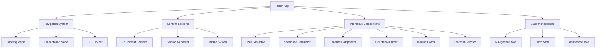

# Design Document

## Overview

The Interactive BCM Proposal is a modern React + TypeScript web application that transforms a static 22-slide business proposal into an engaging, interactive experience. The application serves as a conversion-optimized sales tool for LaVita Code's BCM platform partnership with Grupo Gradual, featuring dual navigation modes, interactive calculators, and persuasive design elements.

### Key Design Principles

1. **Conversion-Focused**: Every component and interaction is designed to maximize conversion (sign intent, schedule meeting, download PDF)
2. **Dual Experience**: Seamless switching between continuous landing page and slide-by-slide presentation modes
3. **Interactive Engagement**: Multiple calculators and interactive elements to help decision-makers visualize value
4. **Accessibility-First**: WCAG AA compliance with keyboard navigation and screen reader support
5. **Performance-Optimized**: Sub-2.5s load times with lazy loading and optimized assets

## Architecture

### High-Level Architecture



### Technology Stack

- **Frontend Framework**: React 18 + TypeScript
- **Build Tool**: Vite 5
- **Styling**: Tailwind CSS 3 with custom theme
- **Animation**: Framer Motion
- **Icons**: Lucide React
- **State Management**: React Context + useReducer
- **Form Handling**: React Hook Form
- **Date/Time**: date-fns
- **Testing**: Vitest + React Testing Library

### Project Structure

```
src/
├── components/
│   ├── common/           # Reusable UI components
│   ├── interactive/      # Interactive calculators and tools
│   ├── navigation/       # Navigation and mode switching
│   └── sections/         # Content section components
├── contexts/             # React contexts for state management
├── hooks/               # Custom React hooks
├── types/               # TypeScript type definitions
├── utils/               # Utility functions and constants
├── styles/              # Global styles and Tailwind config
└── data/                # Static content and configuration
```

## Components and Interfaces

### Core Navigation System

#### NavigationProvider
```typescript
interface NavigationState {
  mode: 'landing' | 'presentation';
  currentSection: number;
  totalSections: number;
  isTransitioning: boolean;
}

interface NavigationActions {
  setMode: (mode: 'landing' | 'presentation') => void;
  goToSection: (index: number) => void;
  nextSection: () => void;
  previousSection: () => void;
  updateProgress: (progress: number) => void;
}
```

#### ModeToggle Component
- Switches between landing and presentation modes
- Preserves current section position across mode changes
- Keyboard accessible with proper ARIA labels

#### ProgressIndicator Component
- Shows reading progress in landing mode
- Displays current section in presentation mode
- Updates URL fragment for bookmarkable positions

### Content Section System

#### Section Component
```typescript
interface SectionProps {
  id: string;
  title: string;
  variant: 'light' | 'dark' | 'teal';
  children: React.ReactNode;
  showHeader?: boolean;
  showFooter?: boolean;
}
```

#### SectionRenderer
- Dynamically renders 22 sections based on configuration
- Applies appropriate theme variants
- Handles scroll-triggered animations in landing mode
- Manages section visibility and focus in presentation mode

### Interactive Components

#### ROI Simulator
```typescript
interface ROISimulatorState {
  subscribers: number;
  planMix: {
    professional: number; // percentage
    clinic: number;       // percentage
    school: number;       // percentage
  };
  mrrMultiple: number;
}

interface ROICalculations {
  monthlyRevenue: number;
  estimatedValuation: number;
  fivePercentValue: number;
}
```

**Key Features:**
- Real-time calculations with <100ms response time
- Pre-configured scenarios (breakeven, 1K subscribers, municipal contract, national presence)
- Input validation and range constraints
- Formatted BRL currency display

#### Softhouse Calculator
```typescript
interface SofthouseCalculatorState {
  monthlyCost: number;
}

interface SofthouseCalculations {
  monthlySavings: number;
  annualSavings: number;
  paybackYears: number;
}
```

**Key Features:**
- 25% discount calculation
- Payback period based on R$75,000 investment
- Reference examples display
- Zero-cost handling

#### Timeline Component
```typescript
interface Tranche {
  id: string;
  amount: number;
  trigger: string;
  deliverables: string[];
  status: 'pending' | 'active' | 'completed';
}
```

**Key Features:**
- Interactive tranche visualization
- Hover/touch reveals for deliverables
- Progress indicator with color gradients
- Accessible keyboard navigation

#### Countdown Timer
```typescript
interface CountdownState {
  days: number;
  hours: number;
  minutes: number;
  seconds: number;
  isExpired: boolean;
}
```

**Key Features:**
- Real-time updates every second
- Configurable deadline (default: May 22, 2026)
- Color changes based on urgency (72-hour threshold)
- Respects reduced motion preferences

### Form Components

#### Intent Form
```typescript
interface IntentFormData {
  fullName: string;
  email: string;
  phone?: string;
  role: string;
  message?: string;
  consentGiven: boolean;
}
```

**Key Features:**
- Client-side validation with real-time feedback
- LGPD compliance with explicit consent
- Configurable submission endpoint
- Fallback mailto link on network errors
- Loading states and success/error handling

### UI Components

#### Module Cards
```typescript
interface ModuleCardProps {
  id: string;
  title: string;
  description: string;
  isExpanded: boolean;
  onToggle: () => void;
}
```

#### Protocol Selector
```typescript
interface ProtocolGroup {
  id: 'bcm-defaults' | 'gradual-preferred';
  name: string;
  protocols: Protocol[];
}

interface Protocol {
  id: string;
  name: string;
  isPriority?: boolean;
}
```

#### Objection Accordion
```typescript
interface ObjectionItem {
  id: string;
  question: string;
  answer: string;
}
```

### Sticky CTA Component
```typescript
interface CTAAction {
  id: string;
  label: string;
  variant: 'primary' | 'secondary' | 'outline';
  action: () => void;
}
```

**Key Features:**
- Fixed positioning in both navigation modes
- Responsive collapse on mobile
- Three primary actions: sign intent, download PDF, schedule meeting
- WCAG AA contrast compliance

## Data Models

### Application Configuration
```typescript
interface AppConfig {
  proposal: {
    title: string;
    subtitle: string;
    validUntil: Date;
    totalInvestment: number;
    tranches: Tranche[];
  };
  endpoints: {
    intentSubmission: string;
    schedulingLink: string;
  };
  assets: {
    pdfUrl: string;
  };
}
```

### Section Configuration
```typescript
interface SectionConfig {
  id: string;
  slug: string;
  title: string;
  variant: 'light' | 'dark' | 'teal';
  component: React.ComponentType;
  showHeader: boolean;
  showFooter: boolean;
  order: number;
}
```

### Theme Configuration
```typescript
interface ThemeConfig {
  colors: {
    primary: string;      // #1B3A6B (blue-trust)
    secondary: string;    // #2D9B8A (green-growth)
    accent: string;       // #F5A623 (amber-urgency)
    purple: string;       // #8B7EC8 (purple-accent)
    lightBase: string;    // #F8F9FA
    darkBase: string;     // #102642
  };
  breakpoints: {
    sm: string;
    md: string;
    lg: string;
    xl: string;
  };
}
```

### Calculator Data Models

#### ROI Scenario
```typescript
interface ROIScenario {
  id: string;
  name: string;
  subscribers: number;
  planMix: {
    professional: number;
    clinic: number;
    school: number;
  };
  mrrMultiple: number;
  description?: string;
}
```

#### Plan Pricing
```typescript
interface PlanPricing {
  professional: number; // R$ 297
  clinic: number;       // R$ 997
  school: number;       // R$ 1,997
}
```

## Technical Implementation Approach

### State Management Strategy

#### Context-Based Architecture
- **NavigationContext**: Manages mode switching and section navigation
- **FormContext**: Handles form state and submission
- **ThemeContext**: Manages theme variants and reduced motion preferences
- **CalculatorContext**: Manages calculator states and computations

#### State Persistence
- URL fragment updates for section navigation
- LocalStorage for user preferences (theme, reduced motion)
- Session storage for form draft data

### Performance Optimization

#### Code Splitting
```typescript
// Lazy load heavy components
const ROISimulator = lazy(() => import('./components/interactive/ROISimulator'));
const SofthouseCalculator = lazy(() => import('./components/interactive/SofthouseCalculator'));
```

#### Asset Optimization
- Image lazy loading with explicit dimensions
- PDF served as static asset with proper caching headers
- Icon tree-shaking with Lucide React
- CSS purging with Tailwind's JIT compiler

#### Bundle Optimization
- Vite's automatic code splitting
- Dynamic imports for section components
- Preload critical resources
- Service worker for offline PDF access

### Animation System

#### Framer Motion Integration
```typescript
interface AnimationConfig {
  reducedMotion: boolean;
  duration: {
    fast: number;    // 200ms
    normal: number;  // 400ms
    slow: number;    // 600ms
  };
  easing: string;
}
```

#### Animation Patterns
- **Scroll Reveals**: Sections animate in as they enter viewport
- **Micro-interactions**: Button hovers, card expansions
- **Mode Transitions**: Smooth switching between navigation modes
- **Loading States**: Skeleton screens and progress indicators

### Accessibility Implementation

#### Keyboard Navigation
- Tab order management with proper focus indicators
- Arrow key navigation in presentation mode
- Escape key to exit modes and close modals
- Enter/Space for interactive elements

#### Screen Reader Support
- Semantic HTML structure with proper landmarks
- ARIA labels and descriptions for complex interactions
- Live regions for dynamic content updates
- Skip links for efficient navigation

#### Visual Accessibility
- WCAG AA contrast ratios (4.5:1 for normal text, 3:1 for large text)
- Focus indicators with sufficient contrast
- Reduced motion support for vestibular disorders
- Scalable text up to 200% without horizontal scrolling

### Responsive Design Strategy

#### Breakpoint System
- **Mobile**: 320px - 767px (single column, stacked components)
- **Tablet**: 768px - 1023px (hybrid layouts, touch-optimized)
- **Desktop**: 1024px+ (full multi-column layouts)

#### Component Adaptation
- Grid systems that collapse to single column on mobile
- Touch-friendly interactive elements (minimum 44px)
- Optimized typography scales for different screen sizes
- Adaptive navigation (hamburger menu on mobile)

## Integration Points and APIs

### External Integrations

#### Intent Form Submission
```typescript
interface IntentSubmissionAPI {
  endpoint: string;
  method: 'POST';
  headers: {
    'Content-Type': 'application/json';
  };
  body: IntentFormData;
}
```

**Expected Response:**
```typescript
interface SubmissionResponse {
  success: boolean;
  message: string;
  id?: string;
}
```

#### Scheduling Integration
- External calendar booking system (Calendly, Acuity, or custom)
- Opens in new tab to preserve proposal context
- Configurable via environment variable

#### PDF Asset Serving
- Static file served from `/public` directory
- Proper MIME type and caching headers
- Fallback handling for missing files

### Environment Configuration

```typescript
interface EnvironmentConfig {
  VITE_INTENT_ENDPOINT: string;
  VITE_SCHEDULING_URL: string;
  VITE_PROPOSAL_DEADLINE: string;
  VITE_GA_TRACKING_ID?: string;
  VITE_HOTJAR_ID?: string;
}
```

### Analytics Integration

#### Event Tracking
```typescript
interface AnalyticsEvents {
  'section_view': { section: string; mode: string };
  'mode_switch': { from: string; to: string };
  'calculator_interaction': { type: string; value: number };
  'cta_click': { action: string; section: string };
  'form_submission': { success: boolean };
  'pdf_download': { timestamp: number };
}
```

### Error Handling Strategy

#### Error Boundaries
- Section-level error boundaries to prevent full app crashes
- Fallback UI for component failures
- Error reporting to monitoring service

#### Network Error Handling
- Retry mechanisms for form submissions
- Offline detection and messaging
- Graceful degradation for missing assets

#### Validation Error Handling
- Real-time form validation with user-friendly messages
- Calculator input validation with range constraints
- URL parameter validation for deep linking

## Testing Strategy

### Unit Testing Approach
- **Component Testing**: Individual component behavior and props
- **Hook Testing**: Custom hooks with various inputs
- **Utility Testing**: Calculation functions and formatters
- **Integration Testing**: Component interactions and state management

### Property-Based Testing

This feature is well-suited for property-based testing due to its mathematical calculations and interactive components. Property-based testing will be implemented using **fast-check** as the PBT library for JavaScript/TypeScript.

#### Property Test Configuration
- **Minimum iterations**: 100 per property test
- **Test tagging**: Each property test must include a comment referencing the design document property
- **Tag format**: `// Feature: proposta-bcm-interativa, Property {number}: {property_text}`

#### Property Test Implementation Requirements
- Each correctness property must be implemented as a SINGLE property-based test
- Tests must run a minimum of 100 iterations due to randomization
- All 7 correctness properties from the design document must be implemented
- Property tests should focus on mathematical correctness and universal behaviors

#### Calculator Correctness Properties
- **ROI Simulator**: Monotonicity and sum consistency properties
- **Softhouse Calculator**: Formula correctness property  
- **Timeline Component**: Sum invariant property
- **Countdown Timer**: Temporal monotonicity property

#### UI Interaction Properties
- **Module Cards**: Toggle idempotence property
- **Currency Formatting**: Function purity property

### Dual Testing Approach
- **Unit tests**: Specific examples, edge cases, and error conditions
- **Property tests**: Universal properties across all inputs
- **Together**: Comprehensive coverage (unit tests catch concrete bugs, property tests verify general correctness)

### Testing Tools and Configuration
- **Test Runner**: Vitest for fast unit tests
- **Component Testing**: React Testing Library
- **Property Testing**: fast-check for JavaScript property-based testing
- **E2E Testing**: Playwright for critical user journeys
- **Accessibility Testing**: axe-core integration

### Test Coverage Goals
- **Unit Tests**: 90%+ coverage for utilities and calculations
- **Component Tests**: All interactive components and user flows
- **Property Tests**: All 7 correctness properties implemented with 100+ iterations each
- **Integration Tests**: Navigation, form submission, mode switching
- **E2E Tests**: Complete user journeys for each persona

## Error Handling

### Client-Side Error Handling

#### Component Error Boundaries
```typescript
interface ErrorBoundaryState {
  hasError: boolean;
  error?: Error;
  errorInfo?: ErrorInfo;
}
```

#### Network Error Handling
- Automatic retry with exponential backoff for form submissions
- Offline detection with appropriate user messaging
- Fallback mechanisms for external service failures

#### Validation Error Handling
- Real-time validation with debounced feedback
- Clear, actionable error messages
- Accessibility-compliant error announcements

### Server-Side Error Handling

#### API Error Responses
```typescript
interface APIError {
  code: string;
  message: string;
  details?: Record<string, any>;
}
```

#### Graceful Degradation
- PDF download fallback to direct link
- Calculator functionality without external APIs
- Form submission fallback to mailto link

## Security Considerations

### Data Protection
- No sensitive data stored in localStorage
- Form data encrypted in transit (HTTPS)
- LGPD compliance for data collection

### Content Security Policy
```typescript
const csp = {
  'default-src': "'self'",
  'script-src': "'self' 'unsafe-inline'",
  'style-src': "'self' 'unsafe-inline'",
  'img-src': "'self' data: https:",
  'connect-src': "'self' https://api.example.com"
};
```

### Input Sanitization
- XSS prevention in form inputs
- URL parameter validation
- File upload restrictions (PDF only)

## Correctness Properties

*A property is a characteristic or behavior that should hold true across all valid executions of a system-essentially, a formal statement about what the system should do. Properties serve as the bridge between human-readable specifications and machine-verifiable correctness guarantees.*

### Property 1: ROI Calculator Monotonicity

*For any* valid subscriber count and fixed plan mix and MRR multiple, increasing the subscriber count should result in a non-decreasing 5% value calculation.

**Validates: Requirements 4.7**

### Property 2: ROI Revenue Sum Consistency  

*For any* valid inputs to the ROI calculator, the sum of individual plan revenues (professional + clinic + school) should equal the total monthly revenue displayed, within a tolerance of R$ 0.01.

**Validates: Requirements 4.8**

### Property 3: Softhouse Payback Formula Correctness

*For any* positive monthly cost input, the payback calculation should equal `75000 / (monthly_cost * 0.25 * 12)` within a tolerance of 0.1 years.

**Validates: Requirements 5.5**

### Property 4: Tranche Sum Invariant

*For any* configuration of the three tranches, the total amount displayed should always equal the sum of the individual tranche values (T1 + T2 + T3).

**Validates: Requirements 6.5**

### Property 5: Countdown Timer Monotonic Decrease

*For any* timestamp before the deadline, consecutive updates of the countdown timer should show strictly decreasing values in seconds.

**Validates: Requirements 7.5**

### Property 6: Module Card Toggle Idempotence

*For any* module card in any initial state, applying the toggle operation twice consecutively should result in the card returning to its original state.

**Validates: Requirements 9.4**

### Property 7: Currency Formatting Purity

*For any* monetary value, the formatting function should produce identical output when called multiple times with the same input (referential transparency).

**Validates: Requirements 17.4**

This design document provides a comprehensive technical foundation for implementing the Interactive BCM Proposal application, ensuring all requirements are addressed while maintaining high standards for performance, accessibility, and user experience.